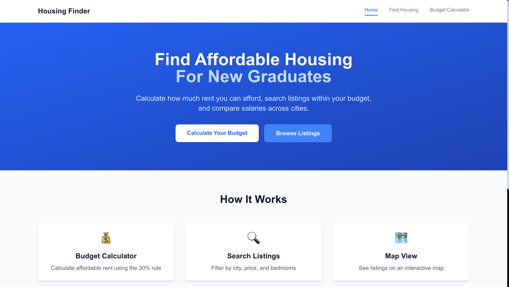
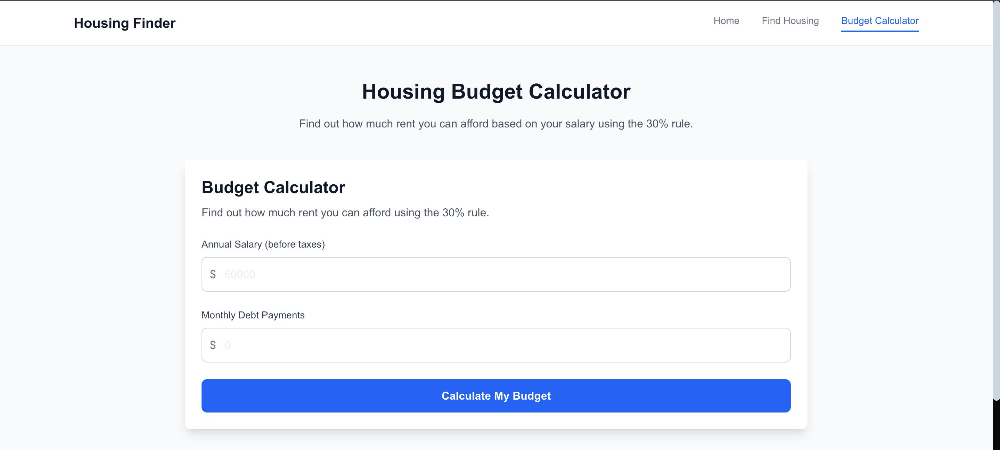

# Affordable Housing Finder

A full-stack web application helping new graduates find affordable housing based on their salary and location preferences.

## Live Demo

- **Frontend:** https://affordable-housing-finder.vercel.app
- **Backend API:** https://affordable-housing-finder.onrender.com

## Screenshots




## Features

- **Budget Calculator** - Calculate affordable rent using the 30% income rule
- **Housing Search** - Filter listings by city, price, bedrooms, and property type
- **Interactive Map** - View listings on a map with location markers
- **Financial Health Score** - Get personalized affordability recommendations

## Future Improvements

- **Illustration**:Add images to depict the housing database
- **Salary Tool**: Add salary tools for new grads that want to estimate how much each month they need to save in order to afford a certain housing option 
- **Roommate Portal**: Add a portal to match roommates base on preferences


## Tech Stack

**Frontend:** Next.js 14, TypeScript, Tailwind CSS, Leaflet.js

**Backend:** Python, FastAPI, SQLAlchemy, SQLite

**Deployment:** Vercel (frontend), Render (backend)

## Local Development

```bash
# Backend
cd backend
pip install -r requirements.txt
python seed_data.py
uvicorn app.main:app --reload

# Frontend
cd frontend
npm install
npm run dev
```

## API Endpoints

| Method | Endpoint | Description |
|--------|----------|-------------|
| GET | `/api/listings` | Get all listings with optional filters |
| GET | `/api/listings/{id}` | Get a specific listing |
| POST | `/api/calculator/budget` | Calculate budget breakdown |

